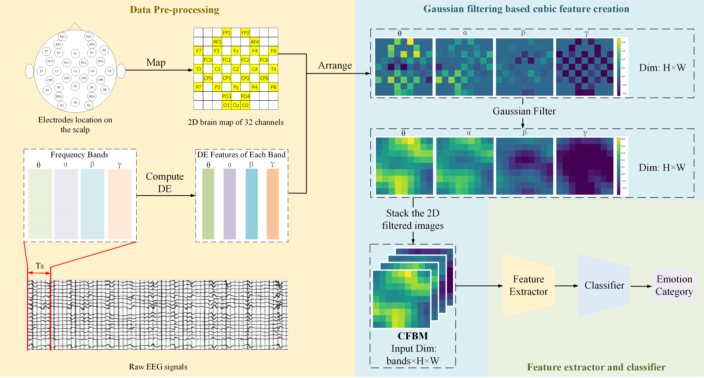
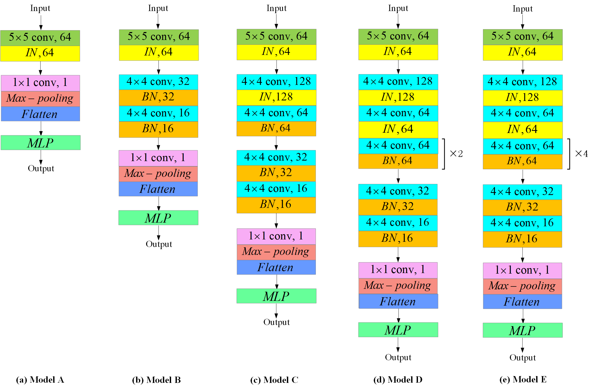

<h1 align="center">
  <a href="https://ieeexplore.ieee.org/abstract/document/10981248">
    CFBM: Cubic Filtered Brain Map Creation Method and Models for Eeg-Based Emotion Recognition
  </a>
</h1>

<p align="center">
  <a href="https://scholar.google.com/citations?user=AZSVH9sAAAAJ&hl=en">Xuange Gao<sup>1,2</sup></a>, 
  Danli Wang<sup>1,2†</sup>, 
  Yanyan Zhao<sup>1,2</sup>, 
  Xinyuan Wang<sup>1,2</sup>
</p>

<p align="center">
<sup>1</sup>State Key Laboratory of Multimodal Artificial Intelligence Systems, <br>Institute of Automation, Chinese Academy of Sciences 
<br>
<sup>2</sup>School of Artificial Intelligence, University of Chinese Academy of Sciences
<br>

</p>

<p align="center"><em><strong>2025 IEEE 22nd International Symposium on Biomedical Imaging (ISBI)</em></p>


## Abstract

Emotion recognition based on electroencephalogram (EEG) is one of the most prominent areas within biomedical research. With the advancement of deep learning, many studies have focused on developing more complex models to improve recognition performance. However, these approaches can not resolve the challenges posed by the low discriminability of EEG data. In this paper, we propose a Cubic Filtered Brain Map (CFBM) creation method for EEG-based emotion recognition, which introduces an innovative use of Gaussian filtering to enhance feature extraction, thereby improving the discriminability of the EEG data. We theoretically demonstrate the effectiveness of CFBM in reducing noise, enhancing spatial continuity, and improving feature discriminability. Additionally, we propose convolutional neural network (CNN) models that incorporate instance normalization (IN) and batch normalization (BN). Extensive experiments conducted on the DEAP dataset demonstrate the effectiveness of CFBM in enhancing EEG data discriminability across various model architectures. The recognition accuracies for valence and arousal reach 99.34\% and 99.29\%, achieving state-of-the-art performance.

## Method

### Cublic Filtered Brain Map Creation Method Overview
<p align="center">
  
</p>

### Models Overview
<p align="center">
  
</p>

## Experimental Results

<h4 align="center">Table: Acc ± std (%) of our and comparison works on the DEAP dataset under subject-dependent ten-fold cross-validation setting.</h3>

<div align="center">

<table>
  <thead>
    <tr>
      <th>Methods</th>
      <th>Valence</th>
      <th>Arousal</th>
    </tr>
  </thead>
  <tbody>
    <tr><td>HOLO-FM </td><td>76.61 ± 2.13</td><td>77.72 ± 2.87</td></tr>
    <tr><td>ATDD-LSTM </td><td>90.91 ± 12.95</td><td>90.87 ± 11.32</td></tr>
    <tr><td>CADD-DCGNN </td><td>90.97 ± 13.96</td><td>92.42 ± 12.72</td></tr>
    <tr><td>ACRNN </td><td>93.72 ± 3.21</td><td>93.38 ± 3.73</td></tr>
    <tr><td>STFCGAT </td><td>95.70 ± 3.36</td><td>95.04 ± 3.02</td></tr>
    <tr><td>DBGC-ATFFNet-AFTL </td><td>95.91 ± 3.27</td><td>94.61 ± 2.89</td></tr>
    <tr><td>SST-Emo </td><td>96.28 ± 2.34</td><td>95.25 ± 2.93</td></tr>
    <tr style="background-color:#f9f9f9;">
  <td><strong>CFBM (ours)</strong></td>
  <td><strong>99.34 ± 0.53</strong></td>
  <td><strong>99.29 ± 0.70</strong></td>
</tr>
  </tbody>
</table>

</div>


<!-- <p align="center"><em>Note:</em> [1]–[7] refer to the corresponding references in the paper.</p> -->


## Requirements
### Installation
The following commands create and activate a virtual environment named cfbm, and install PyTorch along with its corresponding CUDA components. 
Other packages can be installed as needed based on your specific requirements.

```bash
conda create -n cfbm python=3.8
conda activate cfbm
conda install pytorch==2.3.0 torchvision==0.18.0 torchaudio==2.3.0 pytorch-cuda=11.8 -c pytorch -c nvidia
```

### Data Download
We use the DEAP dataset in our paper, which can be applied for and downloaded from its [official website](https://www.eecs.qmul.ac.uk/mmv/datasets/deap/).


## Get Started

### Step 1: Cublic Filtered Brain Map Creation

* Modify the data path `dataset_dir` in the `DEAP_data_extract.py` to your own path of the original DEAP dataset.
* Then run the following code:

```bash
cd your_file_path/CFBM
python ./datasets/preprocessing/DEAP_data_extract.py
python ./datasets/preprocessing/CFBM_DEAP.py
```

### Step 2: Config
* You can create your own bash scripts to run the training process. Below is an example:

```bash
#!/bin/bash


script_name=$(basename "$0")
run_name="./checkpoints/results/${script_name::-3}.txt"


CUDA_VISIBLE_DEVICES=1 python ./train/train.py \
--batch-size 256 \
--learning-rate 2.5e-4 \
--epoch-num 30 \
--dependent-save-file $run_name \
--model-used 'Model_A' \
```


### Step 3: Running
* Create the `checkpoints` folder with two subfolders: `pth` and `results`:

```bash
checkpoints/
├── pth/
└── results/
```
* Once the setup has been verified, proceed with the following step:


```bash
bash ./scripts/debug.sh
```

For more details, please refer to our paper.

## Acknowledgement

This repo benefits from [4D-CRNN](https://github.com/aug08/4D-CRNN).

<!-- Special thanks go to [Tongtian Yue](https://scholar.google.com/citations?user=OrICiVQAAAAJ&hl=en) for his invaluable assistance throughout the experiment, writing, and refinement processes of this work. We encourage you to check out and follow his related projects in Efficient Multimodal Pre-training. -->

## Citation

```bibtex
@inproceedings{gao2025cfbm,
  title={CFBM: Cubic Filtered Brain Map Creation Method and Models for Eeg-Based Emotion Recognition},
  author={Gao, Xuange and Wang, Danli and Zhao, Yanyan and Wang, Xinyuan},
  booktitle={2025 IEEE 22nd International Symposium on Biomedical Imaging (ISBI)},
  pages={1--5},
  year={2025},
  organization={IEEE}
}
